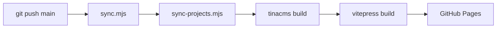

# Draven's Blog ☕

English | [简体中文](./README.md)

<p align="center">
  
  
  
  
  
  
  
</p>

<p align="center">
  <b>📝 Write Locally &nbsp;·&nbsp; 🔄 Auto Sync &nbsp;·&nbsp; 🚀 One-Click Deploy</b>
</p>

---

Hi, I'm **[K-zhaochao](https://github.com/K-zhaochao)**, an undergraduate majoring in Computer Science and Technology (Class of 2024).

This is my personal blog for recording learning, practice, and reflections. It mainly hosts my learning notes, tech stack documentation (currently focusing on **Java Backend Development**), and project practice experiences.

---

## 🧰 Tech Stack

| Layer | Tech | Purpose |
|:---:|------|------|
| 🖊️ Writing | Obsidian + Markdown | Local note-taking with wikilinks & image management |
| 🧩 CMS | TinaCMS | Visual content management (thoughts / projects) |
| ⚡ Framework | VitePress + Vue 3 | Static site generation & custom theme |
| 🔧 Scripts | Node.js (chokidar) | Syntax cleaning / hot-reload sync |
| 🚀 Deploy | GitHub Actions + Pages | CI/CD automated build & publish |

---

## ✨ Features

<table>
  <tr>
    <td width="50%">
      <h4>📝 Dual-Path Content Management</h4>
      <p>Obsidian for notes + TinaCMS for articles — two systems, zero conflicts</p>
    </td>
    <td width="50%">
      <h4>🔄 Frictionless Automation</h4>
      <p><code>git push</code> → auto syntax cleaning → build → deploy, fully hands-off</p>
    </td>
  </tr>
  <tr>
    <td>
      <h4>🎨 Cyberpunk Purple Theme</h4>
      <p>Custom VitePress theme with dark mode + neon purple accents</p>
    </td>
    <td>
      <h4>🔍 Full-Text Search</h4>
      <p>Built-in VitePress search — locate notes & articles in seconds</p>
    </td>
  </tr>
  <tr>
    <td>
      <h4>📱 Responsive Design</h4>
      <p>Desktop / tablet / mobile — optimized reading experience across all devices</p>
    </td>
    <td>
      <h4>🚀 Enhanced Project Showcase</h4>
      <p>GitHub status auto-tracking, category grouping, dual-link buttons, mobile bottom sheet</p>
    </td>
  </tr>
</table>

---

## 💡 Why This Project?

> The faintest ink is better than the best memory. No matter how many tutorials you watch, if you don't turn them into your own output, they will eventually be forgotten.

This site was built to create a **low-friction, local-first content publishing pipeline**:

```
  I just write Markdown, quietly
              ↓
  Layout / Build / Publish → fully automated
```

---

## 🛠️ Workflow Architecture

### 1. 📝 Learning Notes: Obsidian → Auto Sync

If you use Obsidian, you know the struggle: `[[wikilinks]]` and `![[image syntax]]` simply don't render in most frontend frameworks.

My solution: **source isolation + zero redundancy + automatic syntax cleaning**.

```
┌─────────────────────────────────────────────────────┐
│  Draven_Note/  (Obsidian vault — source of truth)    │
│  ├── Java/        ├── Python/      ├── Redis/        │
│  └── Draven_Note_Images/  (image assets)             │
│                         │                            │
│    Windows mklink /J ──→┘  (directory junction)      │
│                         │                            │
│  scripts/sync.mjs ──────→  syntax cleaning            │
│    • [[wikilink]]  →  [text](./path.md)              │
│    • ![[image]]    →                 │
│    • Callout blocks →  VitePress-compatible           │
│                         │                            │
│  docs/notes/  ←──────────  auto-generated output      │
│    (consumed directly by VitePress, no manual edits)  │
└─────────────────────────────────────────────────────┘
```

### 2. 🧩 Thoughts & Projects: TinaCMS Visual Management

- Visit `/admin/` in your browser → WYSIWYG editor
- Content stored as Markdown in Git, fully isolated from Obsidian notes
- `tina/config.ts` defines Collection Schema: `thoughts` / `projects`

### 3. 🚀 Deployment Pipeline



---

## 📁 Project Structure

```
Draven-Blogs/
├── Draven_Note/              ← Obsidian vault (just write here)
│   ├── Java/                 #   Java learning notes
│   ├── JavaWeb/              #   JavaWeb notes
│   ├── Python/               #   Python notes
│   ├── Redis/                #   Redis notes
│   ├── 苍穹外卖/              #   Project practice notes
│   └── Draven_Note_Images/   #   Image assets (mklink → public)
│
├── docs/                     ← VitePress frontend
│   ├── .vitepress/           #   Config & custom theme
│   ├── notes/                #   ← Auto-generated by sync.mjs
│   ├── thoughts/             #   ← Managed by TinaCMS
│   ├── projects/             #   ← Managed by TinaCMS
│   └── public/               #   Static assets & Admin UI
│
├── tina/                     ← TinaCMS configuration
│   └── config.ts             #   Collection Schema definitions
│
├── scripts/                  ← Automation toolchain
│   ├── sync.mjs              #   Obsidian → VitePress syntax cleaning
│   └── sync-projects.mjs     #   Project info sync
│
└── .github/workflows/        ← CI/CD auto-deployment
```

---

## 🚀 Local Development

```bash
# Install dependencies
npm install

# Start dev server (sync + TinaCMS + VitePress)
npm run dev
```

> 💡 First-time setup requires TinaCMS environment variables (see [CI/CD Deployment](#️-cicd-deployment)). `.env` is already in `.gitignore`.

### Available Commands

| Command | Description |
|------|------|
| `npm run dev` | Sync notes + TinaCMS + VitePress dev server |
| `npm run build` | Sync + TinaCMS build + VitePress production build |
| `npm run sync` | Only sync notes + project info |
| `npm run watch` | Watch note changes & sync in real-time |
| `npm run tina:dev` | Only start TinaCMS + VitePress (skip sync) |
| `npm run preview` | Preview production build |

After startup:

- 🏠 Blog → `http://localhost:5173/`
- ✏️ TinaCMS Editor → `http://localhost:5173/admin/index.html`

---

## ⚙️ CI/CD Deployment

Automatically deployed to **GitHub Pages** via **GitHub Actions** on every push to `main`.

### Required Secrets

Configure in **Settings → Secrets and variables → Actions**:

| Secret | Description |
|--------|-------------|
| `TINA_CLIENT_ID` | TinaCMS Cloud project Client ID |
| `TINA_TOKEN` | TinaCMS Cloud API Token (Content Read-only) |

---

## 📝 Registration Info

- [ICP: 黔ICP备2025056580号](https://beian.miit.gov.cn/)
- [Public Security: 贵公网安备52052302000396号](https://beian.mps.gov.cn/#/query/webSearch?code=52052302000396)

---

<p align="center">
  <sub>📝 Keep coding, keep thinking.</sub>
</p>
