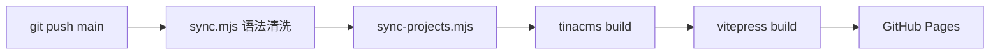

基于 VitePress + TinaCMS 的个人技术博客，自动同步 Obsidian 笔记，GitHub Actions 自动构建部署。

<!-- @sync-readme:start -->

> 以下内容由 `sync-projects.mjs` 自动从 [GitHub 仓库](https://github.com/K-zhaochao/Draven-Blogs) 的 README.md 同步。

# Draven's Blog ☕

[English](https://github.com/K-zhaochao/Draven-Blogs/blob/main/README_en.md) | 简体中文

<p align="center">
  
  
  
  
  
  
  
</p>

<p align="center">
  <b>📝 本地写作  ·  🔄 自动同步  ·  🚀 一键部署</b>
</p>

---

Hi，我是 **[K-zhaochao](https://github.com/K-zhaochao)**，一名 24 级计算机科学与技术专业的在校生。

这里是我的个人博客，用于记录学习、实践与思考。主要存放学习笔记、梳理技术栈（目前主攻 **Java 后端开发**），以及记录项目实战的踩坑过程。

---

## 🧰 技术栈

| 层级     | 技术                     | 用途               |
|:------:| ---------------------- | ---------------- |
| 🖊️ 写作 | Obsidian + Markdown    | 本地笔记编写，双链 & 图片管理 |
| 🧩 CMS | TinaCMS                | 可视化内容管理（思考/项目）   |
| ⚡ 框架   | VitePress + Vue 3      | 静态站点生成 & 自定义主题   |
| 🔧 脚本  | Node.js (chokidar)     | 语法清洗 / 热重载同步     |
| 🚀 部署  | GitHub Actions + Pages | CI/CD 自动构建与发布    |

---

## ✨ 特性

<table>
  <tr>
    <td width="50%">
      <h4>📝 双路径内容管理</h4>
      <p>Obsidian 管笔记 + TinaCMS 管文章，两套系统各司其职、互不干扰</p>
    </td>
    <td width="50%">
      <h4>🔄 零摩擦自动化</h4>
      <p><code>git push</code> → 自动语法清洗 → 构建 → 部署，全程无感</p>
    </td>
  </tr>
  <tr>
    <td>
      <h4>🎨 赛博朋克紫色主题</h4>
      <p>自定义 VitePress 主题，暗色系 + 霓虹紫点缀，极客风拉满</p>
    </td>
    <td>
      <h4>🔍 全文搜索</h4>
      <p>VitePress 内置搜索，笔记 / 文章内容秒级定位</p>
    </td>
  </tr>
  <tr>
    <td>
      <h4>📱 响应式设计</h4>
      <p>桌面 / 平板 / 手机全端适配，移动端阅读体验优化</p>
    </td>
    <td>
      <h4>🚀 项目展示增强</h4>
      <p>GitHub 状态自动追踪、分类目录、双链接按钮、移动端 Bottom Sheet</p>
    </td>
  </tr>
</table>

---

## 💡 为什么有这个项目？

> 好记性不如烂笔头。看过再多教程，如果不转化为自己的输出，最终也会被慢慢遗忘。

建这个站的初衷，是搭建一套 **低阻力、纯本地体验的内容输出流水线**：

```
  我只需要安静地写 Markdown
              ↓
  排版 / 编译 / 发布 → 全部交给自动化
```

---

## 🛠️ 工作流架构

### 1. 📝 学习笔记：Obsidian 本地编写 → 自动同步

如果你也用 Obsidian 记笔记，你一定懂：`[[双向链接]]` 和 `![[图片语法]]` 在大多数前端框架里根本无法直接渲染。

为了解决这个问题，我设计了一套 **源隔离 + 零冗余 + 自动清洗** 方案：

```
┌─────────────────────────────────────────────────────┐
│  Draven_Note/  (Obsidian 笔记源，真实内容驻地)        │
│  ├── Java/        ├── Python/      ├── Redis/       │
│  └── Draven_Note_Images/  (图片素材)                 │
│                         │                           │
│    Windows mklink /J ──→┘  (目录联接，零冗余)         │
│                         │                           │
│  scripts/sync.mjs ──────→  语法清洗                  │
│    • [[wikilink]]  →  [text](./path.md)             │
│    • ![[image]]    →                │
│    • Callout 语法  →  VitePress 兼容块               │
│                         │                           │
│  docs/notes/  ←──────────  自动输出                  │
│    (VitePress 直接消费，无需手动维护)                 │
└─────────────────────────────────────────────────────┘
```

### 2. 🧩 思考 & 项目：TinaCMS 可视化管理

- 浏览器访问 `/admin/` → 所见即所得编辑器
- 内容以 Markdown 存于 Git，与 Obsidian 笔记完全隔离
- `tina/config.ts` 定义 Collection Schema：`thoughts` / `projects`

### 3. 🚀 部署流水线



---

## 📁 项目结构

```
Draven-Blogs/
├── Draven_Note/              ← Obsidian 笔记源（你只管在这里写）
│   ├── Java/                 #   Java 学习笔记
│   ├── JavaWeb/              #   JavaWeb 笔记
│   ├── Python/               #   Python 笔记
│   ├── Redis/                #   Redis 笔记
│   ├── 苍穹外卖/              #   项目实战笔记
│   └── Draven_Note_Images/   #   图片资源（mklink 映射到 public）
│
├── docs/                     ← VitePress 前端项目
│   ├── .vitepress/           #   配置 & 自定义主题
│   ├── notes/                #   ← sync.mjs 自动生成
│   ├── thoughts/             #   ← TinaCMS 管理
│   ├── projects/             #   ← TinaCMS 管理
│   └── public/               #   静态资源 & Admin UI
│
├── tina/                     ← TinaCMS 配置
│   └── config.ts             #   Collection Schema 定义
│
├── scripts/                  ← 自动化工具链
│   ├── sync.mjs              #   Obsidian → VitePress 语法清洗
│   └── sync-projects.mjs     #   项目信息同步
│
└── .github/workflows/        ← CI/CD 自动部署
```

---

## 🚀 本地开发

```bash
# 安装依赖
npm install

# 启动开发服务器（同步笔记 + TinaCMS + VitePress）
npm run dev
```

> 💡 首次使用需配置 TinaCMS 环境变量（见 [CI/CD 部署](#️-cicd-部署)）。`.env` 已加入 `.gitignore`。

### 可用命令

| 命令                 | 说明                               |
| ------------------ | -------------------------------- |
| `npm run dev`      | 同步笔记 + TinaCMS + VitePress 开发服务器 |
| `npm run build`    | 同步 + TinaCMS 构建 + VitePress 生产构建 |
| `npm run sync`     | 仅执行笔记同步 + 项目信息同步                 |
| `npm run watch`    | 监听笔记变化，实时同步                      |
| `npm run tina:dev` | 仅启动 TinaCMS + VitePress（跳过同步）    |
| `npm run preview`  | 预览生产构建产物                         |

启动后：

- 🏠 博客首页 → `http://localhost:5173/`
- ✏️ TinaCMS 编辑器 → `http://localhost:5173/admin/index.html`

---

## ⚙️ CI/CD 部署

项目通过 **GitHub Actions** 自动部署到 **GitHub Pages**，Push 到 `main` 分支即可触发。

### Secrets 配置

在仓库 **Settings → Secrets and variables → Actions** 中添加：

| Secret           | 说明                                         |
| ---------------- | ------------------------------------------ |
| `TINA_CLIENT_ID` | TinaCMS Cloud 项目 Client ID                 |
| `TINA_TOKEN`     | TinaCMS Cloud API Token（Content Read-only） |

---

## 📝 备案信息

- [黔ICP备2025056580号](https://beian.miit.gov.cn/)
- [贵公网安备52052302000396号](https://beian.mps.gov.cn/#/query/webSearch?code=52052302000396)

---

<p align="center">
  <sub>📝 Keep coding, keep thinking.</sub>
</p>

<!-- @sync-readme:end -->


